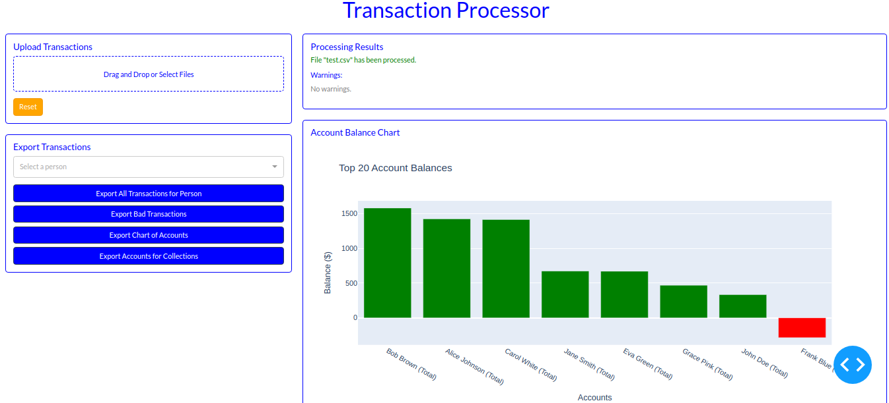

# Transaction Processor



## Overview

The Transaction Processor is a powerful tool designed to process financial transactions, generate reports, and provide insightful visualizations. It offers a user-friendly interface for uploading transaction data, processing it, and exporting detailed reports.

## Features

- Upload and process transaction files
- Generate account balance charts
- Export transaction reports as PDFs
- Interactive dashboard for data visualization
- Robust error handling and reporting

## Setup Instructions

### Prerequisites

- Python 3.8 or higher
- pip (Python package manager)

### Installation

1. Clone the repository:
   ```
   git clone https://github.com/signapay/processor-interview-ut/tree/main
   cd processor-interview-ut
   ```

2. Create a virtual environment:
   ```
   python -m venv venv
   ```

3. Activate the virtual environment:
   - On Windows:
     ```
     venv\Scripts\activate
     ```
   - On macOS and Linux:
     ```
     source venv/bin/activate
     ```

4. Install the required packages:
   ```
   pip install -r requirements.txt
   ```

### Running the Application

1. Start the Dash server:
   ```
   python app.py
   ```

2. Open a web browser and navigate to `http://127.0.0.1:8050/`

## Usage

1. **Upload Transactions**: Use the "Upload Transactions" section to drag and drop or select a CSV file containing transaction data.

2. **Process Data**: The application will automatically process the uploaded file and display the results in the "Processing Results" section.

3. **View Balance Chart**: The "Account Balance Chart" will update to show the top 20 account balances.

4. **Export Transactions**: Select a person from the dropdown in the "Export Transactions" section and click "Export All Transactions for Person" to generate a PDF report.

## File Format

The input CSV file should have the following columns:
- Account Name
- Card Number
- Transaction Amount
- Transaction Type
- Description
- Target Card Number (for transfers)

## Contributing

We welcome contributions! Please see our [Contributing Guidelines](CONTRIBUTING.md) for more details on how to get started, submit pull requests, and participate in the development process.

## License

This project is licensed under the MIT License - see the [LICENSE](LICENSE) file for details.

## Support

If you encounter any issues or have questions, please [open an issue](https://github.com/yourusername/transaction-processor/issues) on our GitHub repository. For more information on how to contribute or report bugs, please refer to our [Contributing Guidelines](CONTRIBUTING.md).
